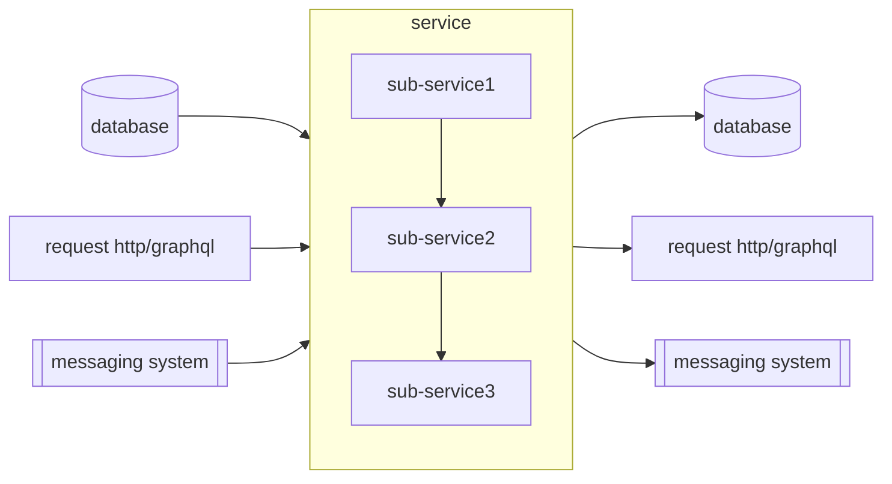

## Service-Name

### contact: Kun

### Badges

A section of badges about build, deploy, code scan, etc

### Description

A section giving brief description for the service.

### Architecture

A section giving a brief architect and related information about the service.

* related info
  1. database: sql/no-sql
  2. messaging system: kafka
  3. others
 
 ### Getting Started
 
 ### testing links
 
 ### Related Links
 
 [Related link 1]()
 [Related link 2]()
